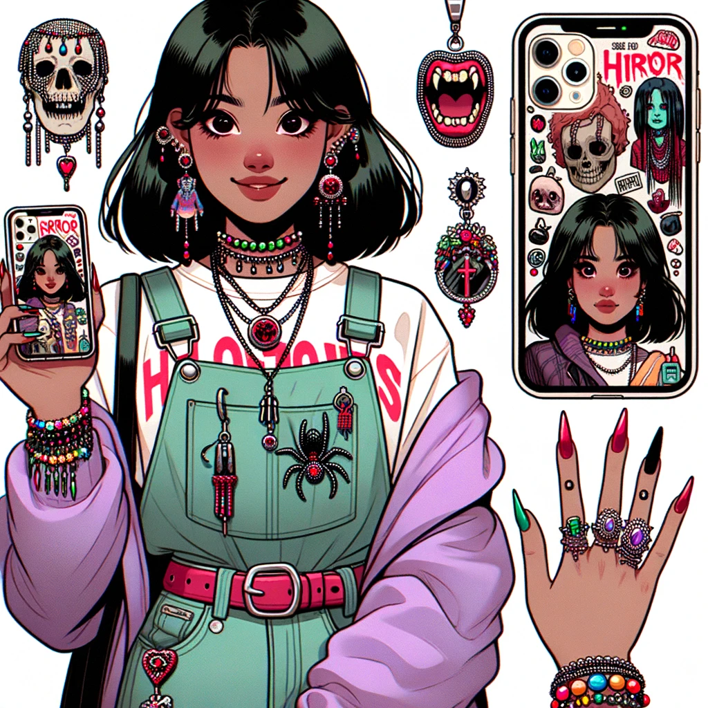

<h1 align="center"><strong>🎃🎃🎃 Trick or Trend: A Halloween Costume sharing WebApp 🎃🎃🎃</strong>
</h1>

  

# SUBMISSION
## Deployment

The project is deployed and can be accessed at [http://your-deployed-link.com](http://your-deployed-link.com).

## Criteria
In this section, we will briefly discuss how our team addressed the applicable criteria:

### 🎃 Creative design that enhances user-experience

The design of the website was inspired by the Halloween theme. The website has a dark theme with orange and purple accents. The website has a clean and simple design, which is easy to navigate. The website is responsive and accessible for different screen sizes. User experience was considered throughout the project, with the target audience discussed in the [Target Audience](###➡️-target-audience) section.

### 🎃 Project fits theme of Halloween

### 🎃 Responsive and accessible for different screen sizes

### 🎃 Project is well planned using Github Projects

### 🎃 Overall project focus is realistic and has a sense of completeness

# ABOUT SUBMISSION
## Intro
One or two paragraphs providing an overview of our project

## Goal
The goal section provides a concise summary of the main objective or purpose of the project or software described in this README. It addresses the following aspects:

### **➡️ Problem Statement**

The problem statement for this project was that there was no clean website to exclusively share your Halloween costume with your friends and family. You would have to send them individually to each person, which would be time consuming and tedious. Or share on a generic social media platform, where it would get lost in the feed.

### **➡️ Objective(s)**

The objective of this project was to create a website where users could share their Halloween costumes with their friends and family. The website would be easy to use and have a clean Halloween user interface. The website would also be responsive and accessible for different screen sizes.

### **➡️ Target Audience**

The target audience were 16-25 year olds who were looking for a fun and easy way to share their Halloween costumes with their friends and family.

- They enjoy Halloween Parties, Horror Franchises and Socialising with their friends. 
- Their pain points would potentially be outdated user interfaces, slow loading times or the app being too similar to other social media platforms.

**User Stories:**

The user stories took into account the target audience and their pain points. The user stories were created using the Miro board.

As a returning user, I need to access a **responsive design** on mobile, desktop and all mainstream devices in between.

As a returning user, I need to be able to **upload** my latest costume ideas to the app

As a returning user, I need to be able to log in and see my **previous uploads**

As a returning user, I need to be able to **update** or **delete** my costume picture

As a returning user, I need to **engage** with the online community through votes and comments

As a returning user, I need to be able to **interact** with the gallery in different views, such as detailed and grid.

As a returning user, I want to feel **inspired** by other user's creativity: their costumes, ideas

As a returning user, I want to be able to check my **favourites** and **save** costumes for later

**Target Audience Profile 1: Mia (pictured in heading)**

> Age: 18
> 
> Appearance: Mia, has a vibrant energy about her. Her smartphone, adorned with a horror-themed case, is always in hand, capturing moments or chatting with friends.
> 
> Personality:
> 
> - Creative Flair: Mia has a knack for arts and crafts. She often creates her own horror-themed jewelry and accessories.
> - Horror Series Fanatic: While she loves horror movies, Mia is especially fond of horror TV series. She often hosts binge-watching sessions with her friends.
> - Life of the Party: Social and outgoing, Mia is often the center of attention without even trying. She loves dancing, singing, and making everyone around her laugh.
> - Halloween Lover: Every year, Mia and her friends embark on a project to create a haunted house experience for the neighborhood kids. Her creativity truly shines during this season.
> - Hobbies: Mia loves DIY projects, especially those related to horror themes. She also enjoys reading horror novels, attending live horror escape rooms, and exploring horror-themed cafes and bars.

**Target Audience Profile 2: Jake**

> Age: 18
> 
> Appearance: Jake is always seen with his latest model smartphone, a testament to his love for technology.
> 
> Personality:
> 
> - Tech-Savvy: Jake is always up-to-date with the latest apps, especially those related to socializing and entertainment.
> - Horror Buff: He owns an impressive collection of horror movie Blu-rays, posters, and memorabilia. Jake can recite lines from classic horror movies and loves discussing fan theories.
> - Social Butterfly: Active on various social media platforms, he's the one who always knows about the latest events and gatherings. He enjoys meeting new people and can strike up a conversation with just about anyone.
> - Halloween Enthusiast: Jake starts planning his Halloween costume months in advance. Every year, he throws a Halloween party that's the talk of the town, complete with themed games, music, and decorations.
> - Hobbies: Apart from watching horror movies, Jake enjoys video gaming (especially horror-themed games), attending horror conventions, and exploring haunted locations with friends.

### **➡️ Benefits**

## Tech
In the tech section, we provide information about the technology stack, dependencies, and any technical details related to the project.

- **Languages:** HTML5, CSS3, Javascript, Python. These were used to create the project.
- **Frontend: React, Bootstrap.** These were used to create the frontend of the project.
- **Backend: Django.** This was used to create the backend of the project.
- [Miro](https://miro.com/) - Miro was used to brainstorm ideas as a team and user stories for the project.
- [Figma](https://www.figma.com/) - Figma was used to create the wireframe for the project.
- [GPT4 with DALLE3](https://openai.com/blog/openai-api/) - GPT4 was used to generate moodboard images for the project.

## Credits
In the credits section, we provide information about the sources used